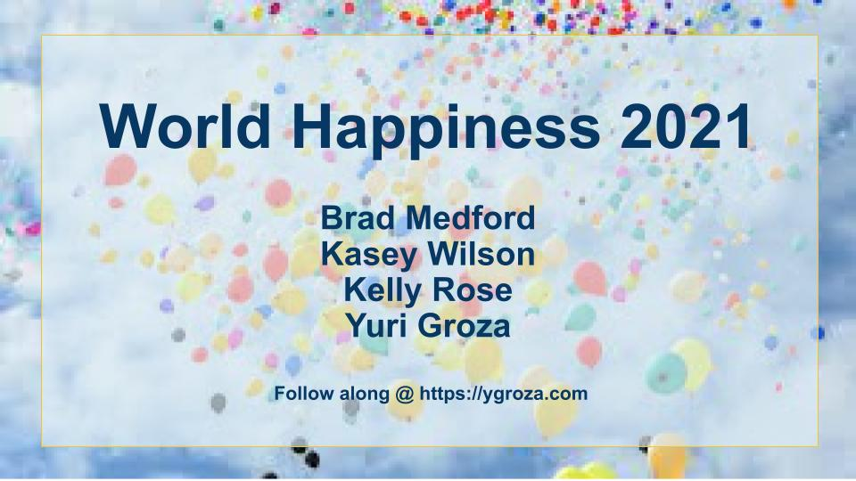
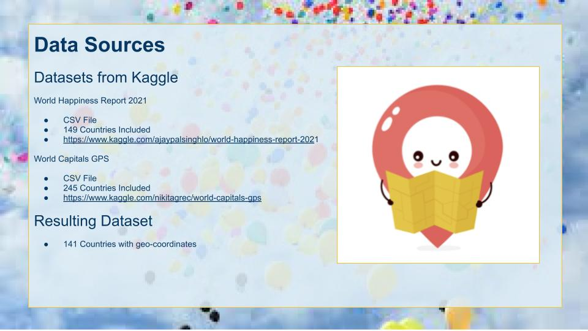
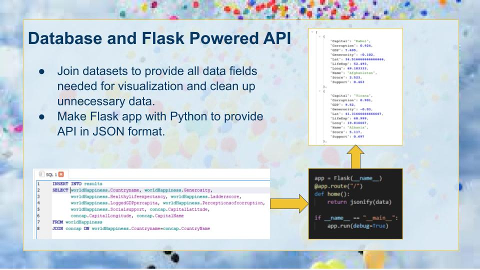
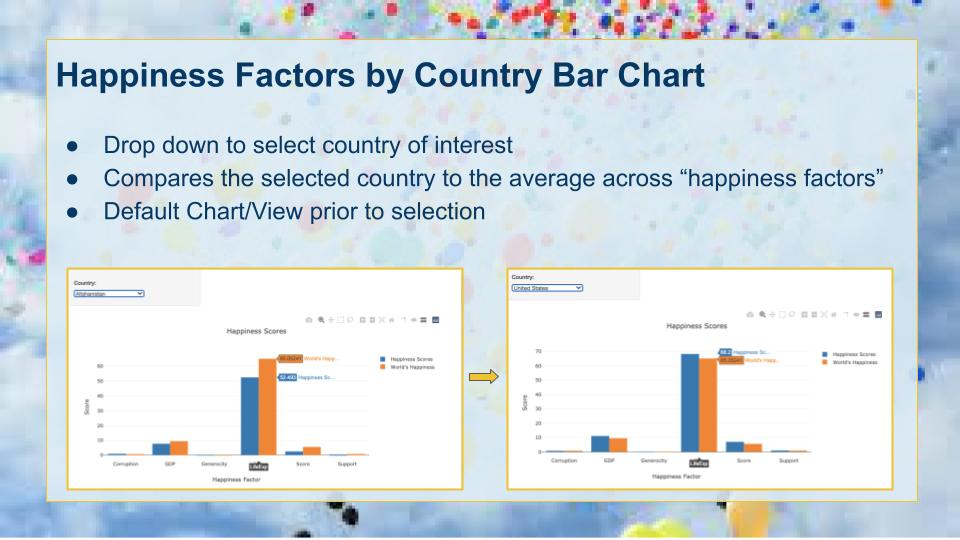
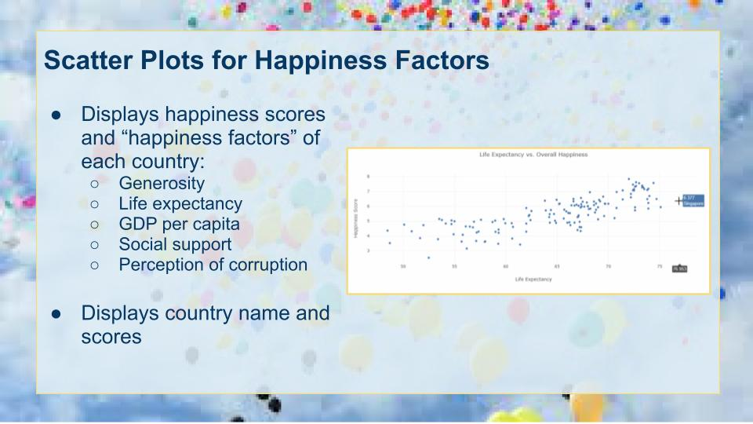
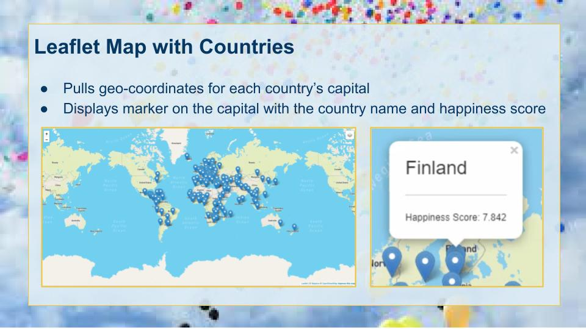
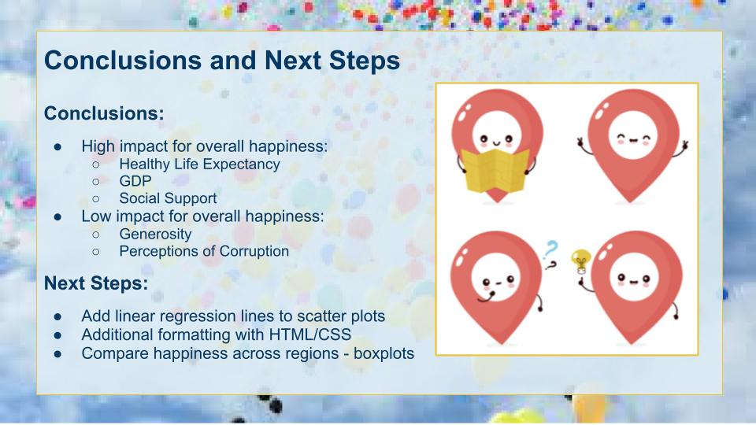

# WorldHappinessViz

## Team Members:

* Kasey Wilson
* Yuri Groza
* Brad Medford
* Kelly Rose 

## Project Description/Outline:

* Visualization includes a Python Flask-powered API, HTML/CSS, JavaScript, and an SQL database. 
* In addition to the above, we utilized: Heroku, Bootstrap, Plotly, Leaflet and D3
* Powered by a dataset with over 100 records
* Includes user-driven interaction via a drop down selection and interactive map.
* Final product includes 7 visualizations. 

## Datasets:

We utilized the following dataset related to 2021 World Happiness, procured from Kaggle. Includes a CSV file. 
* https://www.kaggle.com/ajaypalsinghlo/world-happiness-report-2021

We utilized the following dataset to provide geo-coordinates for the countries in the above dataset.
* https://www.kaggle.com/nikitagrec/world-capitals-gps 

## Rough Breakdown of Tasks
* Imported CSVs into Python to generate a flask-powered API
* Created SQL database and loaded data. Joined the two datasets to include geo-coordinates. 
* Created HTML and CSS that displays a live dashboard page with multiple charts that pull from our dataset. 
* Created Leaflet map with markers and layers from the dataset. 
* Created interactive dropdown to select a country and display the "happiness factor" scores for the respective country in a bar chart next to the average across all countries. 
* Created scatter plots that display the "happiness factors" vs. the overall happiness score for each country. 
* Rendered this page using Heroku to https://ygroza.com 

 
 
 
